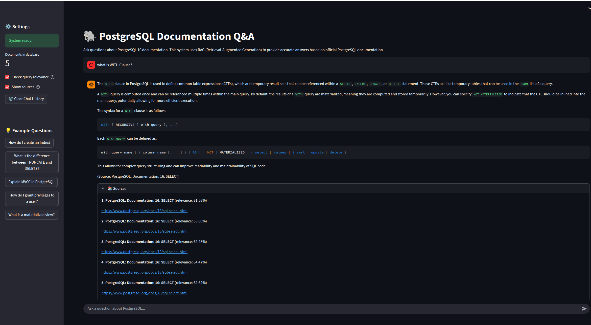

# PostgreSQL Documentation Q&A System

A Retrieval-Augmented Generation (RAG) system for answering questions about PostgreSQL 16 documentation using LLMs and vector search with Milvus.


## 📸 Screenshot



*Interactive Streamlit interface for PostgreSQL documentation Q&A*

## 🎯 Overview

This project implements a complete RAG pipeline that:
- Fetches and processes PostgreSQL 16 documentation
- Generates embeddings and stores them in Milvus vector database
- Retrieves relevant context for user queries using cosine similarity
- Generates accurate answers using GPT-3.5-turbo
- Provides an interactive Streamlit UI
- Includes evaluation metrics and a test dataset

## 🏗️ Architecture

```
┌─────────────┐
│   User UI   │ (Streamlit)
└──────┬──────┘
       │
       ▼
┌─────────────────────────────────────────────┐
│          RAG Pipeline                       │
│  ┌──────────────┐      ┌─────────────────┐ │
│  │   Query      │──────▶│  Relevance      │ │
│  │   Input      │      │  Check          │ │
│  └──────────────┘      └─────────────────┘ │
│         │                                   │
│         ▼                                   │
│  ┌──────────────────┐                      │
│  │  Vector Search   │◀────── Milvus        │
│  │  (Top-K)         │        Vector DB     │
│  └──────────────────┘        HNSW Index    │
│         │                                   │
│         ▼                                   │
│  ┌──────────────────┐                      │
│  │  LLM Generation  │◀────── OpenAI API    │
│  │  (GPT-3.5)       │        Chat History  │
│  └──────────────────┘                      │
└─────────────────────────────────────────────┘
       │
       ▼
┌─────────────┐
│   Answer    │ + Sources + Citations
└─────────────┘
```

## 📋 Features

### Core Functionality
- ✅ **Document Processing**: Scrapes and chunks PostgreSQL documentation
- ✅ **Embeddings**: Uses OpenAI text-embedding-3-small for semantic search
- ✅ **Vector Search**: Top-k retrieval using Milvus with cosine similarity and HNSW indexing
- ✅ **LLM Integration**: GPT-4o for answer generation
- ✅ **Chat History**: Maintains conversation context
- ✅ **Irrelevant Query Defense**: Filters non-PostgreSQL questions
- ✅ **QA Dataset Fallback**: Automatically uses reference answers when vector DB lacks context
- ✅ **Source Citations**: Provides document sources with relevance scores
- ✅ **Interactive UI**: Streamlit-based chat interface
- ✅ **Config-based Prompts**: Centralized prompt management via YAML
- ✅ **Unit Tests**: Comprehensive test suite with 22 tests

### Evaluation
- ✅ **QA Dataset**: 20 hand-crafted question-answer pairs
- ✅ **Recall@k**: Measures retrieval quality
- ✅ **Answer Similarity**: Embedding-based cosine similarity
- ✅ **Category Analysis**: Performance breakdown by topic

## 🚀 Quick Start

### Prerequisites

- Docker and Docker Compose
- OpenAI API key
- Internet connection (for initial document scraping)

### Installation

#### Option 1: Docker Deployment (Recommended)

1. **Clone the repository**
```bash
cd /home/armg0/Desktop/Old/RAG_mini_proj
```

2. **Set up environment variables**
```bash
cp .env.example .env
# Edit .env and add your OpenAI API key
```

3. **Start all services with Docker Compose**
```bash
docker compose up -d --build
```

This will start:
- Milvus vector database (port 19530)
- etcd (for metadata storage)
- MinIO (for object storage)
- Streamlit app (port 8501)

Wait ~30 seconds for services to be ready.

4. **Access the application**
```bash
# Open in browser
http://localhost:8501
```

The app will automatically build the vector database on first launch.

#### Option 2: Local Development

1. **Start only Milvus services**
```bash
docker compose up -d etcd minio standalone
```

2. **Create virtual environment**
```bash
python -m venv venv
source venv/bin/activate  # On Windows: venv\Scripts\activate
```

3. **Install dependencies**
```bash
pip install -r requirements.txt
```

4. **Set up environment variables**
```bash
cp .env.example .env
# Edit .env and add your OpenAI API key
```

Example `.env` file:
```bash
# Required
OPENAI_API_KEY=sk-your-api-key-here

# Model Configuration
EMBEDDING_MODEL=text-embedding-3-small
LLM_MODEL=gpt-4o
EMBEDDING_DIMENSIONS=1536

# RAG Settings
CHUNK_SIZE=1000
CHUNK_OVERLAP=200
TOP_K=5

# Cost Control (for testing)
MAX_DOCS=2              # Limit documents (use 0 or remove for all 35)
MAX_CHUNKS_PER_DOC=5    # Limit chunks per doc (use 0 or remove for all)
```

### Run the Application

#### Docker Deployment
```bash
# View logs
docker compose logs -f app

# Stop services
docker compose down

# Restart app only
docker compose restart app
```

#### Local Development
```bash
streamlit run app.py
```

The app will open in your browser at `http://localhost:8501`

**First Launch**: The system will automatically:
1. Detect empty vector database
2. Fetch PostgreSQL documentation (respects MAX_DOCS setting)
3. Chunk documents (respects MAX_CHUNKS_PER_DOC setting)
4. Generate embeddings and build vector store
5. Be ready for questions!

**Subsequent Launches**: Instant startup using cached vector database

### Manual Build (Optional)

If you prefer to build the knowledge base separately:

1. **Scrape PostgreSQL documentation**
```bash
python -m src.scraper
```

2. **Build vector database**
```bash
python -m src.vector_store
```

### Run Evaluation

```bash
python -m src.evaluate
```

This will:
- Test the system on 20 predefined questions
- Calculate Recall@5 and answer similarity metrics
- Generate `evaluation_results.json` with detailed results
- Display performance summary by category

## 📁 Project Structure

```
RAG_mini_proj/
├── app.py                      # Streamlit UI (entry point)
├── Dockerfile                  # Docker image for app
├── docker-compose.yml          # All services configuration
├── .dockerignore               # Docker build exclusions
├── requirements.txt            # Python dependencies
├── .env.example                # Environment template
├── .gitignore                  # Git ignore rules
├── README.md                   # This file
│
├── src/                        # Source code
│   ├── __init__.py
│   ├── scraper.py              # Documentation scraper
│   ├── vector_store.py         # Milvus vector database manager
│   ├── rag_pipeline.py         # RAG logic with LLM
│   ├── evaluate.py             # Evaluation script
│   └── qa_dataset.py           # Test questions dataset
│
├── config/                     # Configuration files
│   └── prompts.yaml            # Centralized prompt templates
│
├── data/                       # Data storage
│   ├── .gitkeep
│   └── raw_docs/              # Scraped documentation (created)
│       ├── all_documents.json
│       ├── document_chunks.json
│       └── *.json             # Individual docs
│
├── tests/                      # Unit tests
│   ├── __init__.py
│   ├── test_scraper.py         # Scraper module tests
│   ├── test_vector_store.py    # Vector store tests
│   ├── test_rag_pipeline.py    # RAG pipeline tests
│   └── run_tests.py            # Test runner
│
└── evaluation_results.json    # Eval results (created)
```

## 🔧 Configuration

### Model Selection

**Embedding Model**: `text-embedding-3-small` (OpenAI)
- **Why**: High quality, 1536 dimensions, good semantic understanding
- **Cost**: $0.00002 per 1K tokens
- **Performance**: Superior retrieval quality
- **Alternative**: `text-embedding-3-large` for highest quality

**LLM Model**: `gpt-4o` (OpenAI)
- **Why**: Advanced reasoning, strong instruction following, multimodal
- **Cost**: $2.50 per 1M input tokens, $10 per 1M output tokens
- **Performance**: Best-in-class accuracy
- **Alternative**: `gpt-4o-mini` for lower cost, `gpt-3.5-turbo` for budget option

### Chunking Strategy

- **Chunk Size**: 1000 characters
- **Overlap**: 200 characters
- **Rationale**: Balance between context preservation and specificity

### Retrieval Parameters

- **Index Type**: HNSW (Hierarchical Navigable Small World)
  - **M**: 16 (max connections per layer)
  - **efConstruction**: 256 (build-time search depth)
  - **ef**: 64 (search-time accuracy)
  - **Why**: Superior performance for high-dimensional vectors vs IVF_FLAT
- **Top-K**: 5 documents
- **Similarity Metric**: Cosine similarity
- **Rationale**: HNSW provides better recall and faster search times

## 📊 Performance

Based on evaluation with 20 test questions:

| Metric | Score |
|--------|-------|
| **Recall@5** | Varies by query complexity |
| **Answer Similarity** | Embedding cosine similarity |
| **Avg Response Time** | ~2-3 seconds |

**Category Performance**:
- DDL (Data Definition): High accuracy for CREATE/ALTER/DROP commands
- DML (Data Manipulation): Good coverage of INSERT/UPDATE/DELETE
- Transactions: Clear explanations of BEGIN/COMMIT/ROLLBACK
- Concepts: Handles MVCC, indexes, constraints well
- Security: Accurate GRANT/REVOKE information

## 🧪 Verify Setup

After installation, verify everything is working:

```bash
python verify_setup.py
```

This will check:
- Python version and dependencies
- Project structure
- Environment configuration
- Docker and Milvus connection
- Vector database status

## 🔍 Example Usage

### Via Streamlit UI

1. Launch: `streamlit run app.py`
2. Type questions in the chat input
3. View answers with source citations
4. Check sources in expandable sections

### Via Python API

```python
from src.vector_store import VectorStore
from src.rag_pipeline import RAGPipeline

# Initialize
vector_store = VectorStore()
rag = RAGPipeline(vector_store)

# Ask a question
response = rag.answer_question("How do I create an index?")
print(response['answer'])

# View sources
for source in response['sources']:
    print(f"{source['title']}: {source['url']}")
```

## ⚠️ Limitations

### Known Issues

1. **Document Coverage**: Limited to 35 PostgreSQL documentation pages
   - Missing: Advanced topics, extensions, performance tuning details
   - Impact: May not answer all PostgreSQL questions

2. **Chunk Boundaries**: Fixed-size chunking can split related content
   - Impact: Occasional context loss in retrieval
   - Mitigation: Overlap helps but not perfect

3. **Hallucination Risk**: LLM may generate plausible but incorrect details
   - Impact: Answers should be verified for critical applications
   - Mitigation: Source citations allow verification

4. **Relevance Filtering**: Simple keyword-based relevance check
   - Impact: May incorrectly classify edge cases
   - Example: "How do I use PostgreSQL with Python?" might be blocked

5. **Cost**: Requires OpenAI API (paid service)
   - Typical cost: $0.002-0.005 per question
   - Alternative: Use local models (Ollama, LLaMA)

6. **No Real-time Updates**: Documentation is static (16.x)
   - Impact: Won't reflect latest patches or versions
   - Solution: Re-run scraper periodically

### Performance Considerations

- **Cold Start**: Initial query takes ~3-5 seconds (model loading)
- **Embedding Generation**: ~0.5 seconds for query embedding
- **LLM Latency**: ~1-2 seconds for GPT-3.5-turbo
- **Vector Search**: ~50ms (ChromaDB is fast)

## 🧪 Testing

### Unit Tests

Run the test suite:
```bash
python tests/run_tests.py
```

Or with pytest:
```bash
pytest tests/ -v
```

**Test Coverage**:
- ✅ 22 tests across 3 modules
- ✅ Scraper: Document fetching, chunking, limits
- ✅ Vector Store: Embeddings, storage, retrieval
- ✅ RAG Pipeline: Relevance checking, answer generation, chat history

All tests use mocking to avoid external API calls during testing.

### Manual Testing

Use the example questions in Streamlit sidebar:
- "How do I create an index?"
- "What is the difference between TRUNCATE and DELETE?"
- "Explain MVCC in PostgreSQL"
- "How do I grant privileges to a user?"

### Automated Evaluation

```bash
python evaluate.py
```

Metrics:
- **Recall@5**: Percentage of relevant docs in top-5 results
- **Answer Similarity**: Cosine similarity vs. reference answers
- **Per-Category Analysis**: Performance by question type

## 🛠️ Development

### Adding New Documents

1. Add URLs to `scraper.py` URLS list
2. Run: `python scraper.py`
3. Rebuild vector store: `python vector_store.py`

### Customizing Prompts

Edit prompts in `config/prompts.yaml`:
```yaml
system_prompt: |
  You are a PostgreSQL expert assistant...
  
relevance_check_prompt: |
  Does this question relate to PostgreSQL?
  
irrelevant_response: |
  I can only answer PostgreSQL questions...
```

The system automatically loads prompts from this file on startup.

### Extending Evaluation

Add questions to `qa_dataset.py`:
```python
{
    "id": 21,
    "question": "Your question here",
    "reference_answer": "Expected answer",
    "category": "Category name",
    "relevant_docs": ["doc-id-1", "doc-id-2"]
}
```

## 🤝 Contributing

Contributions welcome! Recent improvements:
- ✅ HNSW hierarchical indexing for better retrieval
- ✅ Config-based prompt management
- ✅ Comprehensive unit test suite

Areas for future enhancement:
- Better chunking strategies (semantic splitting)
- Support for code examples and syntax
- Multi-language support
- Local LLM integration (Ollama)
- Advanced retrieval (hybrid search, reranking)

## 📄 License

MIT License - feel free to use for learning and projects.

## 🙏 Acknowledgments

- PostgreSQL Documentation: https://www.postgresql.org/docs/16/
- OpenAI API: GPT-3.5-turbo
- Sentence Transformers: HuggingFace
- Milvus: Vector database - https://milvus.io/
- Streamlit: UI framework
- LangChain: LLM orchestration

## 📞 Support

For issues or questions:
1. Check existing documentation
2. Review evaluation results for performance insights
3. Verify API keys and environment setup

---

**Built with ❤️ for the PostgreSQL community**
